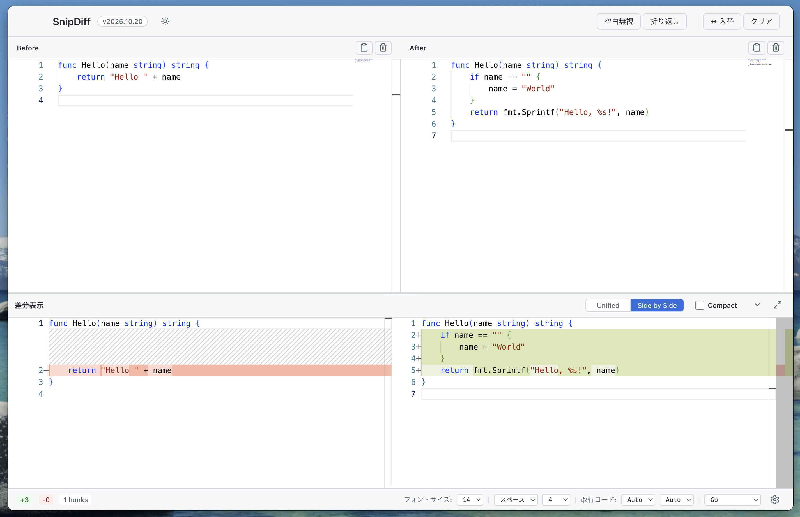
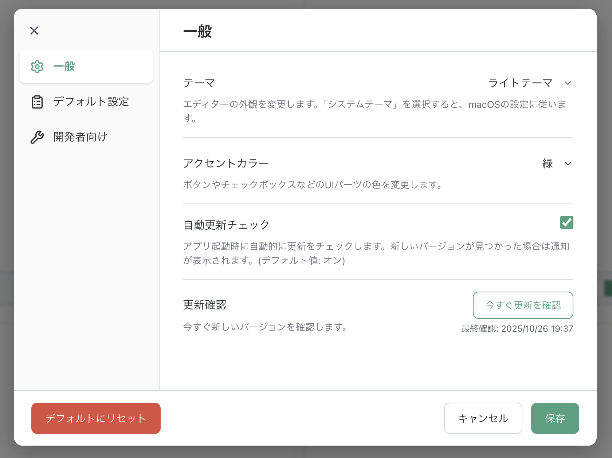

# SnipDiff

未保存テキスト差分ビューア - GitHub-like diff viewer for unsaved text

<div align="center">


</div>

## 概要

**SnipDiff**は、保存していないテキスト同士の差分を、GitHubのdiffに近いUIで高速・安全・オフラインに確認できるmacOSデスクトップアプリケーションです。

コードレビュー、ドキュメント比較、設定ファイルの差分確認など、ファイルとして保存する前にテキストの差分を素早く確認したいシーンで活躍します。

## 主な機能

### ✨ コア機能

- **リアルタイム差分表示**: 2つのテキストを左右のエディタに入力し、即座に差分を確認
- **2つの表示モード**:
  - **Unified**: GitHubスタイルの一体型表示
  - **Side-by-side**: 左右並列の詳細表示
- **Compactモード**: 文字レベルの細かい差分を正確にハイライト表示（変更された文字だけを強調）
- **Monaco Editor搭載**: VS Codeと同じエディタエンジンで快適な編集体験
- **オフライン動作**: ネットワーク接続不要、完全にローカルで動作
- **高速起動**: アプリ起動から差分表示まで1秒未満
- **自動更新**: GitHub Releasesから最新バージョンを自動チェック
  - デフォルトで有効（設定で無効化可能）
  - 更新通知とダウンロード進捗表示
  - アプリ終了時の自動インストール
  - メニューから手動更新チェック可能

### 🎨 カスタマイズ機能

- **テーマ**: ライトテーマ / ダークテーマ / システムテーマ
- **アクセントカラー**: 青色ベース（デフォルト） / 緑色ベース
  - ボタン、チェックボックスなどのUIパーツの色を統一
  - 設定モーダルでリアルタイムプレビュー可能
- **シンタックスハイライト**: 23言語をサポート
  - JavaScript, TypeScript, Python, Java, C#, C++, C, Go, Rust, PHP, Ruby, Swift, Kotlin
  - HTML, CSS, SCSS, JSON, XML, YAML, Markdown, SQL, Shell, Plain Text
- **改行コード指定**: 左右それぞれでLF/CRLF/Autoを選択可能
- **差分オプション**:
  - 空白無視
  - 折り返し表示
- **空白文字の可視化**: スペースやタブを記号で表示
  - 可視化しない / 単語境界のみ可視化 / 選択時のみ可視化 / 行末のみ可視化 / すべて可視化
- **設定の永続化**: すべての設定が自動保存され、アプリ再起動後も維持
  - テーマ、フォントサイズ、比較モード
  - インデント方式、改行コード、言語モード
  - 空白文字の表示設定
  - 自動更新の有効/無効

### 📊 統計情報

- 追加行数 / 削除行数
- Hunks数
- 各エディタの総行数

### 🎯 ユーザビリティ

- **リサイズ可能な比較パネル**: ドラッグで高さ調整
- **最小化/全画面表示**: 作業領域を柔軟に調整
- **左右スワップ**: ワンクリックでBefore/Afterを入れ替え
- **キーボードショートカット**: 主要操作をキーボードで素早く実行

## スクリーンショット

<div align="center">

| Side-by-sideモード | Unifiedモード | Compactモード |
|:---:|:---:|:---:|
| <br>*左右並列での差分表示* | <br>*統合形式での差分表示* | <br>*変更された文字だけを正確にハイライト* |

| 一般 | デフォルト設定（エディタ） |
|:---:|:---:|
| <br>*テーマ、アクセントカラー、自動更新* | <br>*フォントサイズ、空白文字の表示* |
| **デフォルト設定（エディタ）** | **デフォルト設定（差分）** |
| <br>*インデント方式、インデントサイズ、デフォルト改行コード、デフォルト言語モード* | <br>*比較の方式、Compactモード* |

</div>

## インストール

### Homebrew経由 (推奨)

```bash
# 1コマンドでインストール
brew install shiroemons/tap/snip-diff

# または、tapを追加してからインストール
brew tap shiroemons/tap
brew install snip-diff
```

### 初回起動時の注意

このアプリはApple Developer Programに登録され、コード署名とNotarizationが完了しています。公式リリース（GitHub ReleasesまたはHomebrew）からダウンロードした場合、通常は警告なしで起動できます。

ただし、以下の場合は警告が表示されることがあります：
- 開発ビルドやソースからビルドした場合
- ダウンロード後にファイルの検証が完了していない場合

警告が表示された場合：
1. `システム設定 > プライバシーとセキュリティ` を開く
2. 「"SnipDiff"は開発元を確認できないため、使用がブロックされました」の横にある **「このまま開く」** をクリック
3. 確認ダイアログで **「開く」** をクリック

### 配布パッケージから

1. [Releases](../../releases) ページから最新の `.dmg` ファイルをダウンロード
2. `.dmg` を開き、`SnipDiff.app` を Applications フォルダにドラッグ&ドロップ
3. アプリケーションを起動

### ソースからビルド

```bash
# リポジトリをクローン
git clone https://github.com/shiroemons/snip_diff.git
cd snip_diff

# 依存関係をインストール
npm install

# ビルド & パッケージング
npm run dist:mac

# release/SnipDiff-[YYYY.MM.PATCH]-universal.dmg が生成されます
```

## アップデート

### 自動更新（推奨）

SnipDiffは自動更新機能を搭載しており、新しいバージョンがリリースされると自動的に通知されます：
- **デフォルトで有効**（設定で無効化可能）
- **メニューバー** > **SnipDiff** > **更新を確認...** から手動チェック可能
- 更新のダウンロードとインストールを簡単に実行
- アプリ終了時に自動的にインストール

### 手動更新

#### Homebrew経由でインストールした場合

```bash
brew update && brew upgrade shiroemons/tap/snip-diff
```

#### 配布パッケージからインストールした場合

1. [Releases](../../releases) ページから最新の `.dmg` ファイルをダウンロード
2. 既存の `SnipDiff.app` を削除
3. 新しい `.dmg` を開き、`SnipDiff.app` を Applications フォルダにドラッグ&ドロップ

## 使い方

### 基本的なワークフロー

1. **テキスト入力**: 左側のエディタに「Before」、右側に「After」のテキストを入力
2. **差分表示**: テキストを入力すると自動的に下部の比較パネルに差分が表示されます
3. **モード切替**:
   - `⌘1` (Unified) / `⌘2` (Side-by-side) で表示を切り替え
   - `⌘3` で Compactモードをオン/オフ（文字レベルの細かい差分表示）

### オプション設定

アプリケーションは、UI の配置に応じて4つの領域で設定を管理しています。

#### 1. ヘッダーのコントロール

- **テーマ切り替えメニュー**: ライトテーマ / ダークテーマ / システムテーマから選択
- **空白無視**: 空白文字の差異を無視して比較
- **折り返し**: 長い行を折り返して表示
- **左右入れ替え**: Before/After のテキストを入れ替え
- **クリア**: 両側のエディタをクリア

#### 2. 比較パネルのコントロール

- **ビューモード切替**: Unified（統合表示） / Side-by-side（左右並列表示）から選択
  - Unified: ⌘1
  - Side-by-side: ⌘2
- **Compact モード**: 文字レベルの細かい差分のみをハイライト表示（⌘3）
  - オフ: 行全体に背景色が適用され、変更された文字は濃い色でハイライト
  - オン: 変更された文字だけが正確にハイライト表示（共通部分は通常表示）
- **パネル操作**: 最小化 / 全画面表示

#### 3. フッターの設定（現在のセッション）

フッターでは、**現在の比較セッション**の設定を変更できます。

- **統計情報**: 追加/削除行数、hunks 数を表示
- **フォントサイズ**: 10〜36px の範囲で選択（デフォルト: 14px）
- **空白文字の表示**: スペース・タブの可視化方法を選択
  - 可視化しない / 単語境界のみ / 選択時のみ / 行末のみ / すべて可視化（デフォルト）
- **インデント方式**: スペース / タブから選択（デフォルト: スペース）
- **インデントサイズ**: 2 / 4 / 8 スペースから選択（デフォルト: 4）
- **改行コード**: Before/After それぞれに LF / CRLF / Auto を指定
- **言語モード**: シンタックスハイライトの言語を選択（23言語対応）

#### 4. デフォルト設定（設定モーダル）

フッターの ⚙ ボタンから設定モーダルを開くと、**次回起動時や新しい比較開始時の初期値**を設定できます。

**モーダルの構成:**
- **2カラムレイアウト**: ChatGPT風の洗練されたUIデザイン
  - **左サイドバー**: カテゴリナビゲーション（アイコン付き）
  - **右コンテンツエリア**: 選択したカテゴリの設定項目

**設定カテゴリ:**

##### 一般
- **テーマ**: ライトテーマ / ダークテーマ / システムテーマ
- **アクセントカラー**: 青（デフォルト値） / 緑
  - ボタン、チェックボックスなどのUIパーツの色を統一
  - 変更すると即座にプレビュー表示
- **自動更新チェック**: アプリ起動時の自動更新チェックを有効化
  - 手動で「今すぐ更新を確認」ボタンからチェック可能
  - 最終確認日時を表示
- **空白文字の表示**: 可視化しない / 単語境界のみ / 選択時のみ / 行末のみ / すべて可視化

##### デフォルト設定
**エディタ設定:**
- **フォントサイズ**: 10〜36px（2px刻み）
- **インデント方式**: スペース / タブ
- **インデントサイズ**: 2 / 4 / 8
- **デフォルト改行コード**: LF / CRLF / Auto
- **デフォルト言語モード**: 23言語から選択

**差分設定:**
- **比較の方式**: Unified / Side-by-side
- **Compact モード**: オン / オフ

##### 開発者向け（開発環境のみ）
- **開発者モード**: 開発者向けの追加機能を有効化

**設定のリセット:**
- **デフォルトにリセット**ボタンをクリックすると、すべての設定を初期値に戻せます
- リセット後も「保存」ボタンをクリックするまで永続化されないため、安全にプレビューできます

> **使い分けのポイント**:
> - **今の比較をカスタマイズしたい** → フッターで設定を変更
> - **次回からのデフォルトを変えたい** → 設定モーダル（⚙）で保存
> - **設定を初期状態に戻したい** → 設定モーダルの「デフォルトにリセット」ボタン

### キーボードショートカット

| ショートカット | 機能 |
|--------------|------|
| `⌘,` | 環境設定を開く |
| `⌘K` | 両側のエディタをクリア |
| `⌘⇧K` | 左右のテキストを入れ替え |
| `⌘1` | Unifiedモードに切り替え |
| `⌘2` | Side-by-sideモードに切り替え |
| `⌘3` | Compactモードの切り替え |

## 開発

### 必要要件

- **Node.js**: 18以上
- **macOS**: Apple Silicon / Intel 両対応
- **npm**: 8以上

### セットアップ

```bash
# 依存関係をインストール
npm install

# 開発モードで起動 (Hot Reload有効)
npm run dev
```

> **Note:** `npm install` を実行すると、Git Hooksが自動的にセットアップされます。
> これにより、`git commit` や `git push` 前に自動的に型チェック、lint、テストが実行され、問題がある場合はブロックされます。

#### Git Hooks

このプロジェクトでは [simple-git-hooks](https://github.com/toplenboren/simple-git-hooks) を使用して、コード品質を保証しています。

**自動実行される処理:**
- `git commit` 実行時に以下が自動実行されます：
  1. `npm run type-check` - TypeScript型チェック（全プロセス）
  2. `npm run lint` - Biomeによるコードチェック
  3. `npm run test -- --run` - 全テストの実行
- `git push` 実行時にも同様のチェックが実行されます

**エラーが発生した場合:**
- 型エラー、Lintエラー、またはテストの失敗がある場合、commitまたはpushは中止されます
- エラーを修正してから再度実行してください

**フックをスキップする方法:**
（緊急時のみ使用してください）
```bash
# 環境変数を設定してフックをスキップ
SKIP_SIMPLE_GIT_HOOKS=1 git push origin main
```

### 開発コマンド

```bash
# 開発モード起動 (Vite dev server + Electron)
npm run dev

# ビルド (全プロセス)
npm run build

# 個別ビルド
npm run build:renderer  # React アプリ (Vite)
npm run build:main      # メインプロセス (TypeScript)
npm run build:preload   # プリロードスクリプト (TypeScript)

# 配布パッケージ作成
npm run dist:mac        # .dmg (Universal Binary)

# 型チェック
npm run type-check      # 全 tsconfig の型チェック

# リント & フォーマット
npm run lint            # Biome でリント
npm run lint:fix        # 自動修正
npm run format          # フォーマット
npm run check           # リント + フォーマット一括実行

# テスト
npm run test            # Vitest 実行
```

### プロジェクト構造

```
app/
├── main/           # Electron メインプロセス (Node.js 環境)
│   └── main.ts     # アプリケーションエントリーポイント、IPC ハンドラ
├── preload/        # IPC ブリッジ (contextIsolation 対応)
│   └── preload.ts  # レンダラーとメインプロセス間の安全な通信
├── renderer/       # React アプリケーション (ブラウザ環境)
│   ├── components/ # 再利用可能な UI コンポーネント
│   ├── features/   # 機能別コンポーネント (DiffEditor など)
│   ├── stores/     # Zustand 状態管理
│   └── App.tsx     # ルートコンポーネント
└── shared/         # 型定義・ユーティリティ (全プロセス共有)
    └── types/      # TypeScript 型定義
```

### 技術スタック

| カテゴリ | 技術 |
|---------|------|
| **フレームワーク** | Electron 39 |
| **UI** | React 19 |
| **言語** | TypeScript 5 |
| **ビルドツール** | Vite 7 |
| **エディタ** | Monaco Editor (VS Code engine) |
| **状態管理** | Zustand 5 |
| **自動更新** | electron-updater |
| **設定永続化** | electron-store |
| **アイコン** | Lucide React |
| **リント/フォーマット** | Biome |
| **テスト** | Vitest |
| **パッケージング** | electron-builder |

### アーキテクチャ

#### セキュリティ重視の設計

- `contextIsolation: true` - レンダラーとメインプロセスの完全分離
- `sandbox: true` - サンドボックス環境で実行
- `nodeIntegration: false` - Node.js API への直接アクセスを禁止
- `contextBridge` - 安全な IPC 通信のみを公開

#### ビルド出力

- **開発時**: `dist/` にコンパイル結果 + Vite dev server (port 5173)
- **本番時**: `dist/` にバンドル + `app.getAppPath()` でパス解決

#### IPC 通信

主要なチャネル:

- `clipboard:*` - クリップボード読み書き、履歴管理
- `file:*` - ファイル保存/開くダイアログ
- `settings:*` - 設定の読み書き
- `window:*` - ウィンドウ制御 (最小化/最大化/閉じる)
- `theme:*` - システムテーマ取得、変更監視

### 新機能の追加

IPC ハンドラを追加する場合:

1. `app/shared/types/index.ts` にチャネル名を定義
2. `app/preload/preload.ts` で `contextBridge` 経由の API を追加
3. `app/main/main.ts` で `ipcMain.handle` を実装
4. `app/renderer/types/global.d.ts` の `Window.electron` 型を更新

### デバッグ

- **メインプロセス**: ターミナルに出力されるログを確認
- **レンダラープロセス**: 開発モードで自動的に開く DevTools を使用
- **ビルドエラー**: 個別ビルドコマンドで原因を特定

## トラブルシューティング

### アプリが起動しない

- 初回起動時: [初回起動時の注意](#初回起動時の注意) セクションを参照してください
- それ以外の場合: アプリを再インストールするか、[Issues](../../issues) で報告してください

### 差分が表示されない

- 両方のエディタにテキストが入力されているか確認
- 比較ボタンをクリックして手動で比較を実行

### Monaco Editor が表示されない

- 開発者ツールのコンソールでエラーを確認
- `npm run build` を実行して再ビルド

## リリース

### バージョンアップ手順

**バージョン番号の形式**: `YYYY.MM.PATCH`
- `YYYY`: 年（例: 2025）
- `MM`: 月（例: 10）
- `PATCH`: パッチ番号（例: 0, 1, 2...）
- 例: `2025.10.0`, `2025.10.1`, `2025.10.2`

新しいバージョンをリリースする際は、以下の手順に従ってください：

1. **package.json と package-lock.json のバージョンを更新**
   ```bash
   npm version {VERSION} --no-git-tag-version
   # 例: npm version 2025.10.2 --no-git-tag-version
   ```
   このコマンドで `package.json` と `package-lock.json` の両方が自動更新されます

2. **README.md、CHANGELOG.md、app/main/main.ts のバージョンを更新**
   - `README.md` のバージョンバッジ (例: `version-2025.10.2`)
   - `CHANGELOG.md` に新バージョンのエントリを追加（主要な変更点をハイライト形式で記載）
   - `app/main/main.ts` の `app.setAboutPanelOptions` 内の `applicationVersion` と `version`

3. **変更をコミット**
   ```bash
   git add package.json package-lock.json README.md CHANGELOG.md app/main/main.ts
   git commit -m "chore: bump version to {VERSION}"
   # 例: git commit -m "chore: bump version to 2025.10.2"
   ```

4. **変更をプッシュ**
   ```bash
   git push origin main
   ```

5. **タグを作成してプッシュ**
   ```bash
   git tag v{VERSION}
   git push origin main --tags
   # 例: git tag v2025.10.2
   ```

6. **GitHub Actionsによる自動リリース**
   - タグがプッシュされると自動的にビルド・リリースが実行されます
   - `.dmg` ファイルの作成とGitHubリリースへのアップロード
   - Homebrewへの自動配信

## コントリビューション

バグ報告や機能提案は [Issues](../../issues) でお願いします。

プルリクエストも歓迎します:

1. このリポジトリをフォーク
2. フィーチャーブランチを作成 (`git checkout -b feature/amazing-feature`)
3. 変更をコミット (`git commit -m 'feat: add amazing feature'`)
4. ブランチにプッシュ (`git push origin feature/amazing-feature`)
5. プルリクエストを作成

### コミット規約

[Conventional Commits](https://www.conventionalcommits.org/) を使用:

- `feat:` 新機能
- `fix:` バグ修正
- `refactor:` リファクタリング
- `chore:` ビルド・設定変更
- `docs:` ドキュメント
- `test:` テスト

## ライセンス

[MIT License](./LICENSE)

## 関連リンク

- [仕様書 (spec.md)](./spec.md)

---

<div align="center">

Made with ❤️ for developers who love clean diffs

</div>
